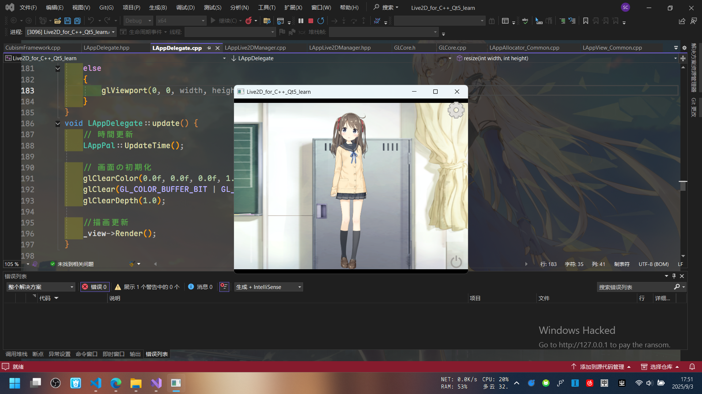
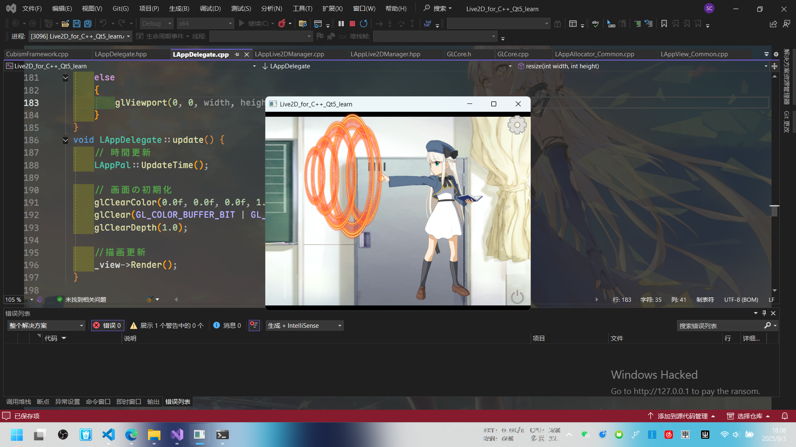

>[!NOTE]
>教程
>[《Live2D SDK For C++Qt(OpenGL)》 by 見崎音羽](https://www.bilibili.com/video/BV1H5k8YPEwz)



debug了两天，一直找为什么模型加载不出来……

程序也不报错……

```
Folder PATH listing for volume home
Volume serial number is 66AD-F4DF
D:.
├─FrameworkShaders
├─Resources
│  ├─Haru
│  │  ├─expressions
│  │  ├─Haru.2048
│  │  ├─motions
│  │  └─sounds
│  ├─Hiyori
│  │  ├─Hiyori.2048
│  │  └─motions
│  ├─Mao
│  │  ├─expressions
│  │  ├─Mao.2048
│  │  └─motions
│  ├─Mark
│  │  ├─Mark.2048
│  │  └─motions
│  ├─Natori
│  │  ├─exp
│  │  ├─motions
│  │  └─Natori.2048
│  ├─Rice
│  │  ├─motions
│  │  └─Rice.2048
│  └─Wanko
│      ├─motions
│      └─Wanko.1024
└─SampleShaders
```
最后发现是**这三个主文件夹**没全部导入……


哭哭哭

---


<span style="color:green;">不管了，先来一发！</span>