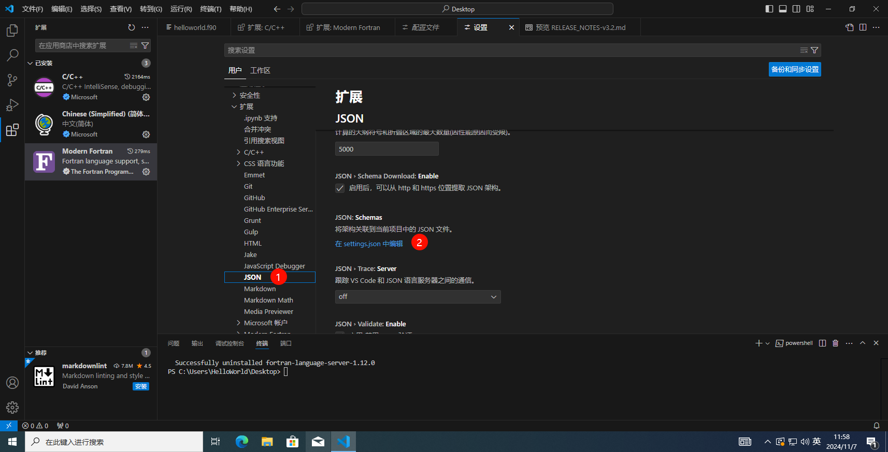

**编写时间：** 2024年11月7日

**环境配置：** gcc + VScode + Python

**条件：** Windows 10 x64 VMware虚拟机

# 前言

这是我出的第2个关于Fortran安装的教程，由于上一个方法对储存空间的要求比较高，并且我个人也不太喜欢用 VS ，比如他一个工程里面只能创建一个文件（大概）。反正我就是菜，我就想搞一个比较方便的，而且有那种代码高亮的。写这种教程的人不止我一个，大家可以参考更优秀的。

如果你认为我写得也可以的话，那你就看吧；如果你认为我写得非常好的话，那就赞一个吧；如果你认为我写得非常垃圾的话，那你就踩一下吧。

# 准备工作
以下3个下载可同时进行

由于有些下载项较慢，可以使用下载器加速下载，如果没有也可以耐心等待，开一局游戏什么的。
## 下载vscode
https://code.visualstudio.com/


## 下载Python
https://www.python.org/

为64位 Windows 系统下载 python 安装包


## 下载gcc

### 为什么要下载gcc


### 如何下载
http://www.equation.com/servlet/equation.cmd?fa=fortran


# 安装
先装哪个无所谓，但**不要同时安装**


## 安装Python


然后等待安装完成，这个时候我们可以开一把（电脑不太行的）。


### 配置镜像源（可选），可解决 Python 安装第三方库下载慢的问题

参考了以下文章：
https://blog.csdn.net/m0_63523451/article/details/128049541?spm=1001.2014.3001.5506

按win+R，输入cmd，回车，在终端输入以下命令，为 Python 写入清华镜像源
~~~shell
pip config set global.index-url https://pypi.tuna.tsinghua.edu.cn/simple
~~~

终端显示了以下信息才算成功（Python安装成功+镜像源写入成功）


## 安装vscode
+ 1、 同意协议
+ 2、 选择路径
+ 3、 默认
+ 4、 可选项 （默认即可）

+ 5、 点击安装并等待安装完成


## 安装gcc
这个尽量最后，可能涉及重启系统

+ 双击
+ 同意协议
+ 选择路径
+ 等待安装完成

# 配置
这是极其关键的一步！

参考了这个视频：
https://www.bilibili.com/video/BV195411c71L/?spm_id_from=333.1007.top_right_bar_window_custom_collection.content.click

如果你确实不想看英文视频的话，你可以跟着我的教程走，当然我是用的 python 完成后面的一些部分，别的一些教程也和这个视频里面的内容大同小异。但是我觉得他的那个运行过程比较麻烦，于是我就自己写了个脚本来完成。

+ 1、运行vscode

    

+ 2、更改为中文

    

    重启并应用更改

    

+ 3、安装插件

    

    如果弹出一个弹窗，请 **无视风险继续安装**（笑）

+ 4、第一个程序

    首先请打开一个文件夹，我这里打开的是桌面，然后创建一个以 .f90或 .f95结尾的文件

    

    在文件中写入以下内容：
    ```diff lang="fortran"
    program helloworld
        implicit none
        print*,"hello,world!"
    end program helloworld
    ```
    我们试着运行一下这段代码

    

    在终端输入以下下命令：

    这个命令的意思是编译这个程序
    ~~~shell
    gfortran helloworld.f90
    ~~~
    或者

    这个命令可以生成一个名为 helloworld 的可执行程序
    ~~~shell
    gfortran helloworld.f90 -o helloworld
    ~~~
    可以看到在桌面出现了一个 a.exe 文件，这是 Fortran 编译器编译好的可执行程序

    

    接着在终端输入以下命令：

    这个命令的意思是执行这个程序a，如果你自定义了文件名，请输入【.\你的文件名】
    ~~~
    .\a
    ~~~
    执行：

    

+ 5、安装其他插件

    你的 vscode 可能会弹出以下内容，如果没有弹出这个通知，也没有关系。

    

    + 
    

    点了 install，没有反应，请按照以下步骤操作：

    win+R，cmd，enter

    在终端输入以下命令

    ~~~shell
    pip install fortran-language-server
    ~~~

    

    安装成功

+ 6、 配置fortls

    可以看到这个插件已经给了我们配置方法

    

    接下来，请跟着我的步骤走：

    
    只需要打开这个 setting.json 文件就可以了，从哪里打开则无需在意
    

    使用everything找到fortls.exe

    
    复制程序路径，在setting.json写入：
    ~~~java
    "fortran.fortls.path": "C:\\Users\\HelloWorld\\AppData\\Roaming\\Python\\Python313\\Scripts\\fortls.exe",
    ~~~
    

+ 7、快速运行Fortran程序

    请参考我写的这篇文章

    https://blog.csdn.net/qq_46603846/article/details/141974803
+ 8、VScode运行Fortran补充（2024年12月26日）
    
    安装这个插件就可以直接运行了

    


至此，配置完成，有谬误请 **（1）在评论区反馈** 或者 **（2）私信我**。

希望我的成果配得上您的一个赞


注意，我不是第一个写这种教程的人，如有雷同，纯属巧合，如有侵权，联系删除
# 参考了以下文章或视频：

https://blog.csdn.net/m0_63523451/article/details/128049541?spm=1001.2014.3001.5506

https://www.bilibili.com/video/BV195411c71L/?spm_id_from=333.1007.top_right_bar_window_custom_collection.content.click
