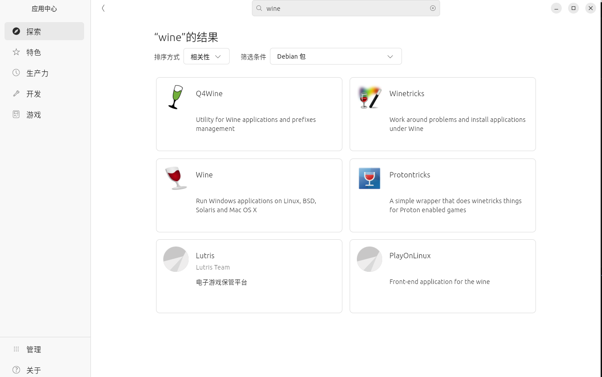
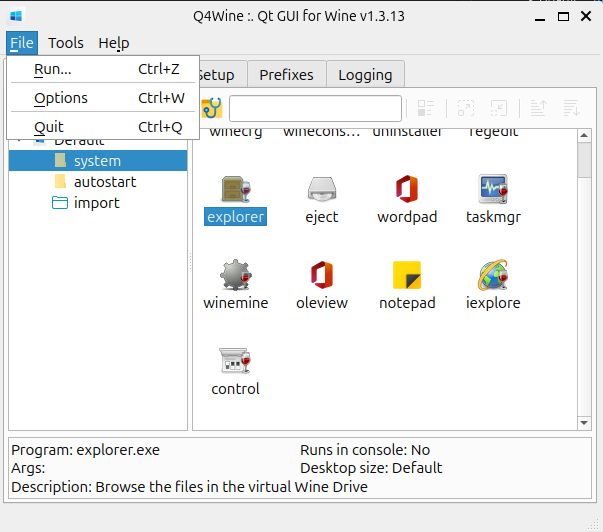
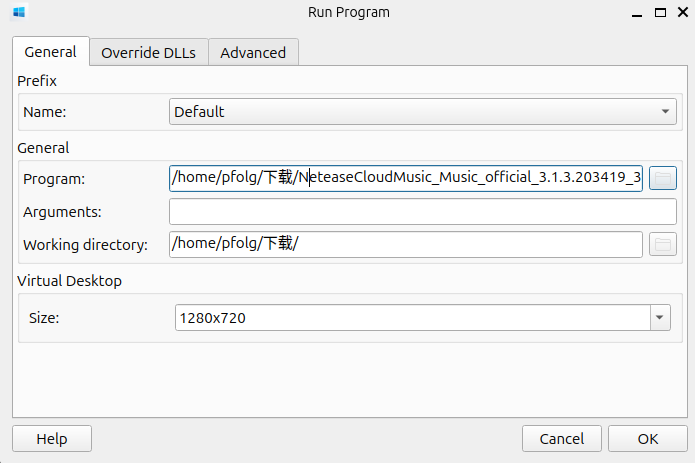
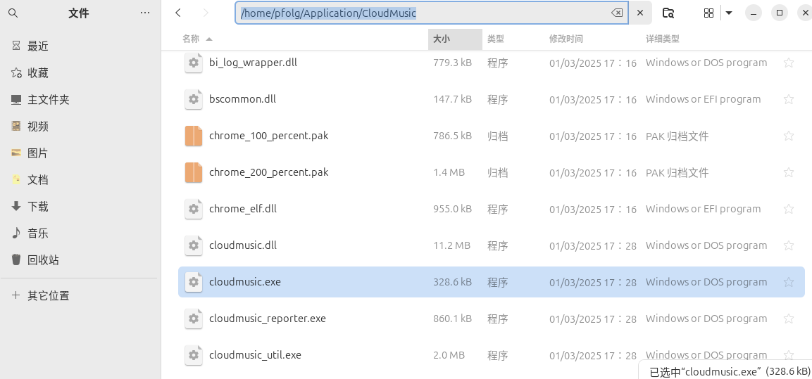

本文旨在讲诉一种在Linux系统上安装网易云音乐的方法

思路：不通过安装deb包或者别的Linux安装包，**直接运行exe程序实现。**

# 具体步骤
## 配置环境
打开：

然后搜索：wine ，并选择Debian包

分别安装**前三个**（从左往右）

## 安装网易云音乐

下载地址：https://music.163.com/#/download

选择最新的windows客户端：PC端，当然，怀旧也可能行。

得到安装包：

打开**Q4Wine**，点击File，点击Run

选择安装包，size自定义：

点击ok运行

接下来就进入了安装程序，选择适合自己的安装方法和路径

我把它放到了~/Application/CloudMusic

当安装程序运行结束后就安装好了

## 运行网易云音乐

同上，选择主程序然后在wine中运行它，运行成功后记得更改网易云的配置，**特别是下载和缓存项**

## Enjoy
