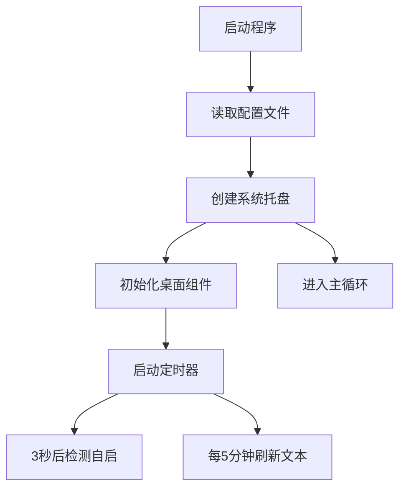

# Quick Tray

::github{repo="Pfolg/QuickTray"}

      

   

|[特点](#特点) | [下载](#下载) | [声明](#声明) | [LICENSE](https://github.com/Pfolg/QuickTray/blob/QuickTray/LICENSE)|
|:--:|:--:|:--:|:--:|

_基于 PySide6 的系统托盘工具应用，主要提供快速启动、文本展示功能。_

<!--  -->

# 特点

+ 系统托盘功能

+ 桌面组件

+ 快捷启动

+ 自启管理

---

**程序流程**

>[!NOTE]
> 程序无主窗口，完全通过托盘图标交互，适合后台轻量级使用。核心是实用的快速启动工具。
>
> 在**ver1.11.2-25718**版本后添加了一个简单的窗口。

# 下载

>[!WARNING]
>  不兼容v1.11之前的版本

| Windows | [releases](https://github.com/Pfolg/QuickTray/releases) |
|:-------:|:-------------------------------------------------------:|

或者

克隆此仓库到本地使用源码`src`运行

**配置文件管理**
| 文件 | 功能说明 |
| ------------------- | ------------------------------ |
| `basic_config.json` | 程序基本设置（图标/端口/自启） |
| `applist.json`      | 菜单项配置（名称/路径/类型） |
| `lines.json`        | 文本标签的随机语录库 |

# 声明

本程序绝不会收集用户信息，源码可查。

若在使用中发现任何问题，还请不吝提Issue，若有想法独到的开发者，欢迎拉取请求！

感谢所有本程序涉及的第三方库及Python语言开发者们，未能一一致谢，抱歉！<!--在后续更新中优化-->

如果程序中涉及的一些材料侵犯了您的版权，请联系我删除！