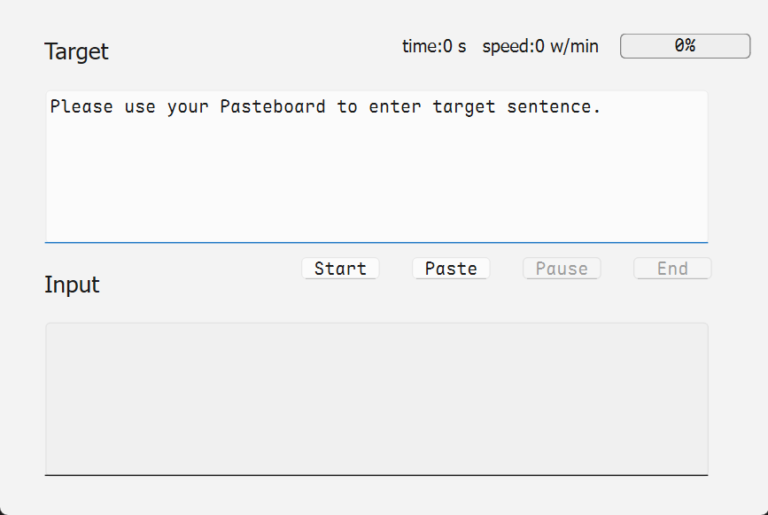
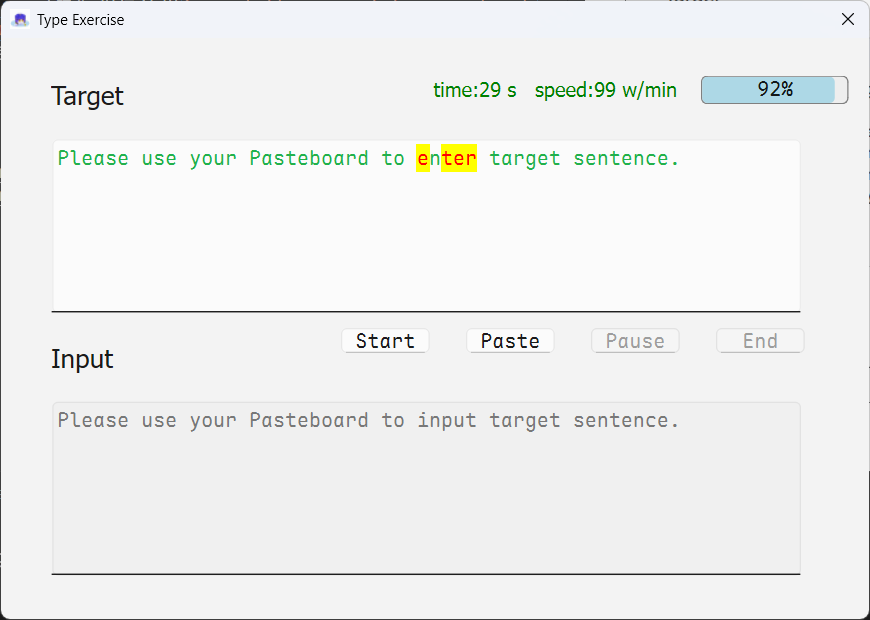
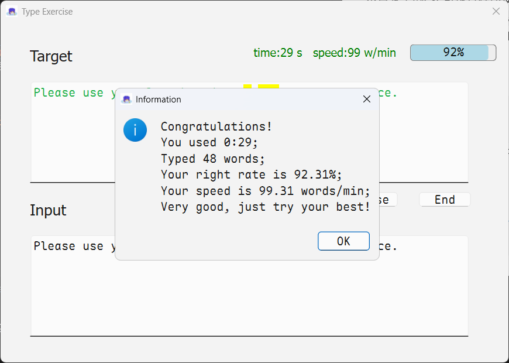

link: https://github.com/Pfolg/PfolgBlog/tree/master/Passages/TypingExercise


这是一款功能简洁的打字练习工具，能够实时追踪输入速度和正确率，通过进度条可视化练习进度，并禁用粘贴功能确保真实训练效果。

核心特点：

1. 实时显示打字速度（字/分钟）和正确率
2. 彩色标记正确/错误字符（绿色正确，红色错误）
3. 禁用粘贴功能保证训练真实性
4. 支持从剪贴板导入练习文本
5. 提供开始/暂停/结束控制和时间统计
6. 训练结束时生成完整数据报告
7. 不会产生缓存数据、不与网络交互

该工具适合需要提升打字速度和准确性的用户，界面简洁直观，操作便捷高效。

具体操作请查看本目录下的演示视频

### 项目结构

源码和相关依赖也放在了本目录下

```shell
---.
- main.py
- requirements.txt
- typing.ui
- 115227382_p0.jpg
```

### 运行

#### 可执行程序

本目录下的exe可执行程序使用`pyinstaller --onefile --windowed --add-data "typing.ui;." --add-data "115227382_p0.jpg;." main.py`命令打包，可直接运行在**Windows 11 24H2**上

#### 源代码

进入源代码所在目录，在此打开终端

使用以下命令配置环境，我强烈推荐使用虚拟环境运行

```shell
pip install -r requirements.txt
```

使用以下命令启动主程序

```shell
python main.py
```

### 预览







### 注意

代码中有使用AI生成的片段，特别是函数`eventFilter`中的警告目前不修复也不影响程序的运行。

代码注释量极少，若有不懂之处，先行咨询AI，如有问题，请提Issue。