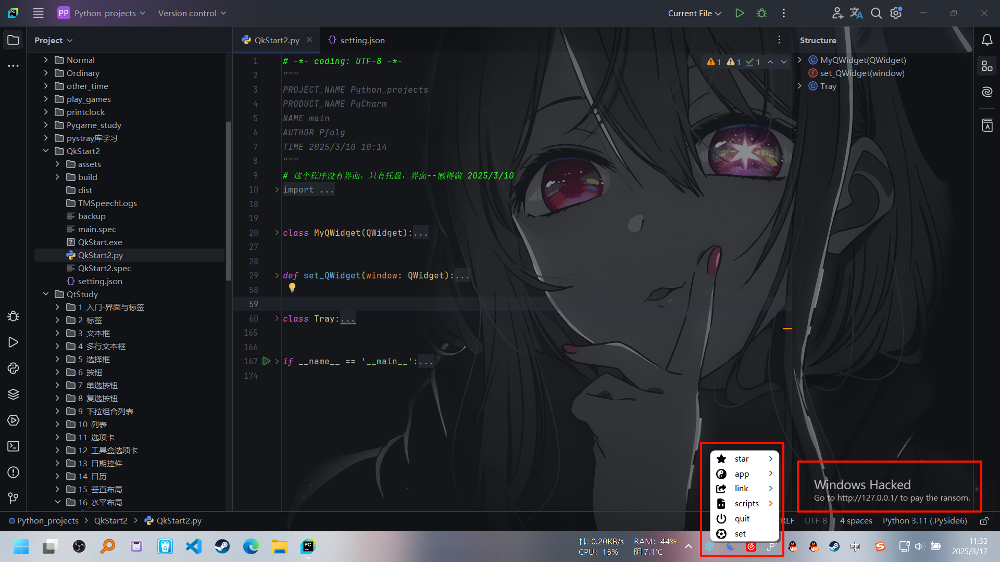

# 简单说明

看了 [男人的乐趣：在已激活 Windows 上强行显示「未激活」状态](https://www.bilibili.com/video/BV1X6PLevEJL/)，然后用了一下，发现与小红车不兼容。觉得可以忍，可以用live2DExViewer平替一下，na，今天开机速读变慢，平时CPU占用变高，于是觉得还是得自己动手。之前也找过[MrGlockenspiel/activate-linux](https://github.com/MrGlockenspiel/activate-linux)，这个又不能隐藏终端，麻了。

那就自己写，问问AI就 _抄_ 出来了，为了避免麻烦，我没有用tkinter（简陋得无与伦比），PyQt6（GUN协议），选择了PySide6（不知道有没有麻烦，有的话我就在GitHub上放一下源码）。na，看看效果：

有工具栏又有水印

# 代码

~~~Python

# -*- coding: UTF-8 -*-

"""
PROJECT_NAME Python_projects
PRODUCT_NAME PyCharm
NAME main
AUTHOR Pfolg
TIME 2025/3/10 10:14
"""

# 这个程序没有界面，只有托盘，界面--懒得做 2025/3/10

import json
import os.path
import sys
import webbrowser

from PySide6.QtCore import Qt
from PySide6.QtGui import QIcon, QAction
from PySide6.QtWidgets import QApplication, QSystemTrayIcon, QMenu, QWidget, QLabel

class MyQWidget(QWidget):
    def __init__(self):
        super().__init__()

    # 忽略关闭事件
    def closeEvent(self, event):
        event.ignore()

def set_QWidget(window: QWidget):
    # 设定窗口
    window.setStyleSheet("background-color: rgba(255, 255, 255, 0);")
    # 窗口位置和大小
    window.setGeometry(1250, 720, 600, 100)
    # 定义标签和父级
    label1 = QLabel(parent=window)
    label2 = QLabel(parent=window)
    # 设置标签在Widget中位置
    label1.setGeometry(0, 0, 400, 50)
    label2.setGeometry(0, 20, 400, 50)
    # 设置样式
    label1.setStyleSheet("""
                background-color: rgba(0, 0, 0, 0);
                color: rgba(255, 255, 255, .7);
                font-size: 18px;
                """)  # font-weight: bold;
    label2.setStyleSheet("""
                background-color: rgba(0, 0, 0, 0);
                color: rgba(255, 255, 255, .7);
                font-size: 12px;
                """)
    # 设置文本
    label1.setText("Windows Hacked")
    label2.setText("Go to http://127.0.0.1/ to pay the ransom.")
    # 启用透明度
    window.setAttribute(Qt.WidgetAttribute.WA_TranslucentBackground, True)
    # 窗口顶置，去标题栏，去除任务栏图标
    window.setWindowFlags(Qt.WindowType.FramelessWindowHint | Qt.WindowType.WindowStaysOnTopHint | Qt.WindowType.Tool)

class Tray:
    def __init__(self):
        self.tray_icon = QSystemTrayIcon()
        self.set_tray()
        self._addActions()
        self.tray_icon.show()

    @staticmethod
    def setting():
        _format = {
            "type": "",
            "name": "",
            "path": "",
            "icon": "",
        }
        if not os.path.exists("setting.json"):
            with open("setting.json", "w", encoding="utf-8") as file:
                json.dump([_format], file, indent=4, ensure_ascii=False)
        os.startfile("setting.json")
    
    @staticmethod
    def readSetting():
        if os.path.exists("setting.json"):
            with open("setting.json", "r", encoding="utf-8") as file:
                data: [] = json.load(file)
            if data:
                return data
            else:
                return []
        else:
            return []
    
    def openTarget(self, p: str):
        print(p)
        try:
            if os.path.exists(p):
                os.startfile(p)
            if p.split(":")[0] in ["http", "https"]:
                webbrowser.open(p)
        except Exception:
            self.tray_icon.showMessage("Error", "未能打开 {}".format(p))
    
    def _addActions(self):
        menu = QMenu()
        # 设定基本动作
        action_setting = QAction(parent=menu)
        action_setting.setIcon(QIcon("assets/solid/futbol.svg"))
        action_setting.setText("set")
        action_setting.triggered.connect(self.setting)
        action_quit = QAction(parent=menu)
        action_quit.setIcon(QIcon("assets/solid/power-off.svg"))
        action_quit.setText("quit")
        action_quit.triggered.connect(sys.exit)
        # 设定子菜单
        menu_star = QMenu()
        menu_star.setTitle("star")
        menu_star.setIcon(QIcon("assets/solid/star.svg"))
        menu_app = QMenu()
        menu_app.setTitle("app")
        menu_app.setIcon(QIcon("assets/solid/yin-yang.svg"))
        menu_link = QMenu()
        menu_link.setTitle("link")
        menu_link.setIcon(QIcon("assets/solid/share-from-square.svg"))
        menu_scripts = QMenu()
        menu_scripts.setTitle("scripts")
        menu_scripts.setIcon(QIcon("assets/solid/file-code.svg"))
        menu.addMenu(menu_star)
        menu.addMenu(menu_app)
        menu.addMenu(menu_link)
        menu.addMenu(menu_scripts)
        menu.addAction(action_quit)
        menu.addAction(action_setting)
        data = self.readSetting()
        # 排序
        data.reverse()
        if data:
            for i in data:
                action = QAction()
                a, b, c, d = i.get("type"), i.get("name"), i.get("path"), i.get("icon")
                print(b, c, d)
                if b:
                    action.setText(b)
                if c:
                    # 通过默认参数传递当前值 c，解决作用域问题——by DeepSeek
                    action.triggered.connect(lambda checked, p=c: self.openTarget(p))
                if d:
                    action.setIcon(QIcon(d))
    
                if a == "star":
                    action.setParent(menu_star)
                    menu_star.addAction(action)
                elif a == "app":
                    action.setParent(menu_app)
                    menu_app.addAction(action)
                elif a == "link":
                    action.setParent(menu_link)
                    menu_link.addAction(action)
                elif a == "scripts":
                    action.setParent(menu_scripts)
                    menu_scripts.addAction(action)
        self.tray_icon.setContextMenu(menu)
    
    def set_tray(self):
        self.tray_icon.setToolTip("QkStart With WaterMark")
        self.tray_icon.setIcon(QIcon("assets/snowflake.png"))

if __name__ == '__main__':
    app = QApplication(sys.argv)
    tray = Tray()
    Widget = MyQWidget()
    set_QWidget(Widget)
    Widget.show()
    sys.exit(app.exec())

~~~

___

闲的……
