有一说一，真的不容易，踩了一堆坑，搞了大概三个小时。~~中间实在是憋不住了，在厕所茅塞顿开了。~~ 😂

本来是想用hexo的，但可能会重蹈以前的覆辙，在浏览主题的时候，看到一个比较好看的主题：

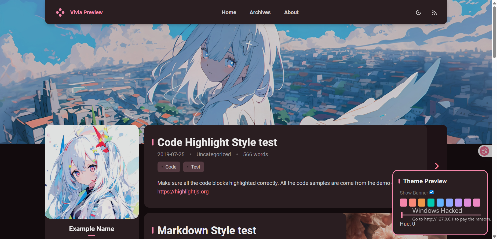

[Vivia Preview](https://saicaca.github.io/vivia-preview/)

[GitHub - saicaca/hexo-theme-vivia: A clean and minimalist theme for Hexo.](https://github.com/saicaca/hexo-theme-vivia)

这能不入？这必须入啊！

结果人家GitHub主页这样写：

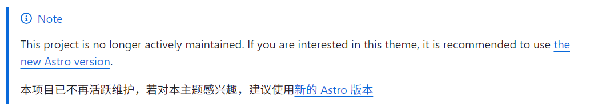

然后就跳转到[下面的那个链接](https://github.com/saicaca/fuwari)了。

接着，咱们的配置开始了。

### 开始之前

请大致浏览一下这篇文章，觉得自己确实没问题再进行实践，否则会损失时间成本。

_以下操作的一个大前提是VsCode是使用Github登录的，也可能是全局git信息已配置完毕_


如果你此前安装了`hexo`，请删掉（可选）。再尝试这个更简单的方法。

> 请你弃坑Hexo，加入Astro！

### 环境配置

不要忽略了[环境配置](https://github.com/saicaca/fuwari/blob/main/docs/README.zh-CN.md#-%E8%A6%81%E6%B1%82)：

#### 安装Node.js

[Node.js — Download Node.js®](https://nodejs.org/zh-cn/download)

下载适合你的系统的安装程序并进行安装。

> 我猜是Windows

安装不用多说，这里给一个验证安装成功的方法：

`Win + R` 键入`cmd` 回车（按Enter）

输入`node -v`，输出类似以下的东西就算成功：

```shell
> node -v
v22.14.0
```

#### 安装npm

AI说是和Node.js一起安装的，验证一下：

```shell
> npm -v
11.4.2
```

#### 安装Git

[Git - Downloads](https://git-scm.com/downloads)

依旧是下载安装验证：

```shell
> git -v
git version 2.48.1.windows.1
```

环境配好了，该克隆仓库了。

---

### 克隆fuwari

#### 创建新仓库

点击此链接进入saicaca/fuwari仓库：

[GitHub - saicaca/fuwari: ✨A static blog template built with Astro.](https://github.com/saicaca/fuwari)

---

然后我们点击`Use this template`>>`Create a new repository`

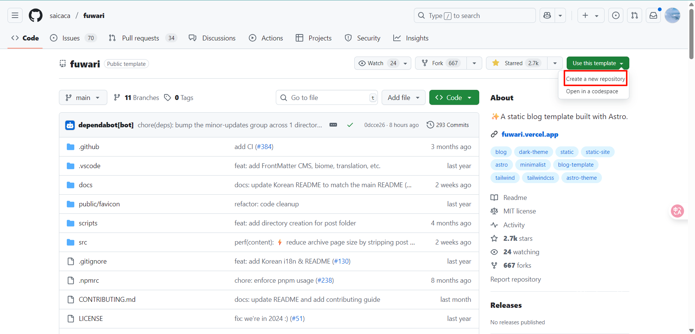

---

填写新仓库信息：

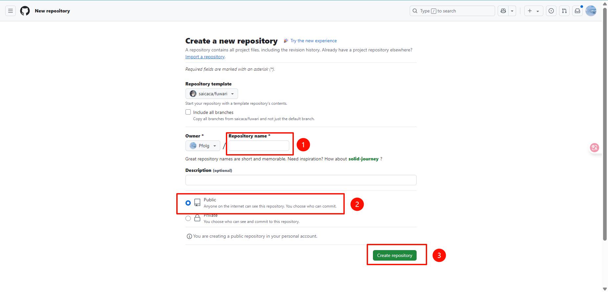

这里我用`fuwari`作为我的新仓库名称。

---

参考[官方的教程](https://github.com/saicaca/fuwari/blob/main/docs/README.zh-CN.md#-%E4%BD%BF%E7%94%A8%E6%96%B9%E6%B3%95-2)，这里我们忽略4、5步以避免对大脑造成不必要的冲击：

> 目前进行到第1步

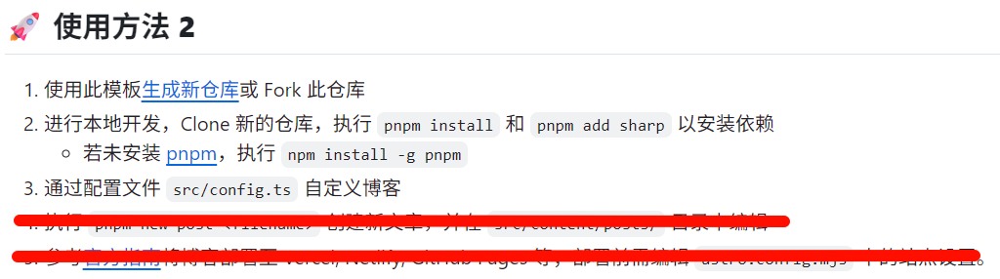

#### 将仓库克隆到本地

打开`VsCode`，随便找个文件夹`初始化仓库`

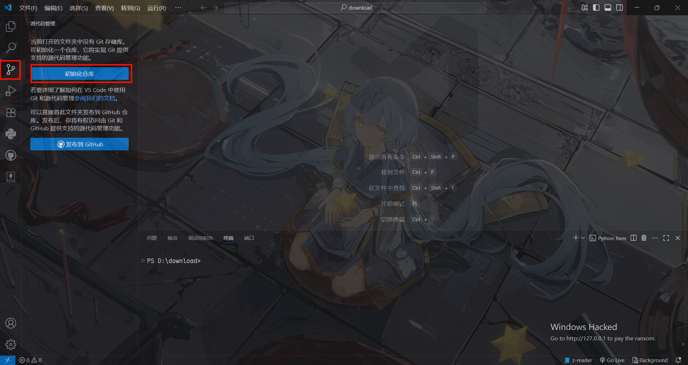

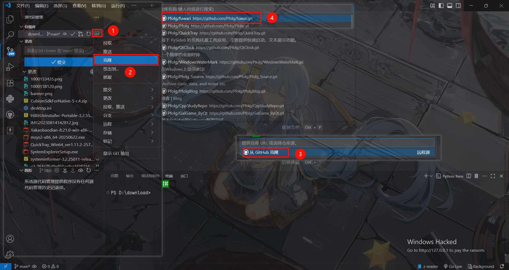

然后选择一个文件夹放置这个仓库。

> 记得把原来那个文件夹产生的`.git`文件夹删了。

#### 初始化环境

打开vscode的终端：

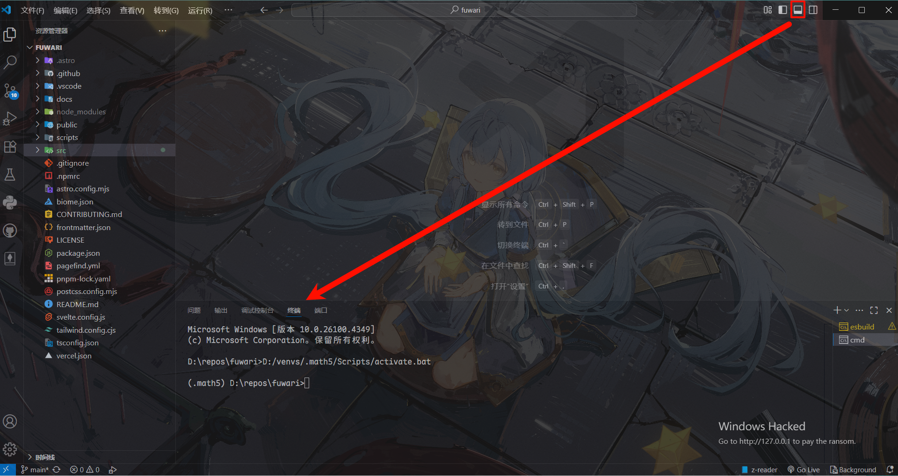

安装pnpm：`npm install -g pnpm`

再执行`pnpm install`和`pnpm add sharp`

这里和配置文件的修改可以参考：[Fuwari静态博客搭建教程 - AcoFork Blog](https://www.afo.im/posts/fuwari/)

### 配置

根据自己的情况酌情修改配置文件：`src\config.ts`

> 也可以不修改，先预览一下再修改：`pnpm dev`，再访问`localhost:4321`

### 提交

这一步（下图）忽略，因为我们用的是VsCode。

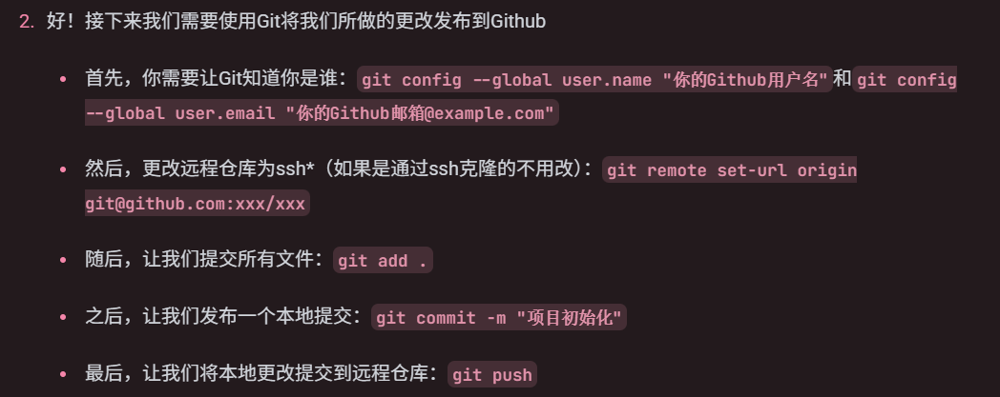

点点鼠标就能做到`add`、`push`，当然，前提是你的VsCode是用GitHub登录的。

如果提示账户相关问题，建议问AI，这两个命令可以解决部分问题：`git config --global user.name "你的Github用户名"`和`git config --global user.email "你的Github邮箱@example.com"

大概点击6下就行了，原理就是上面的那些命令：

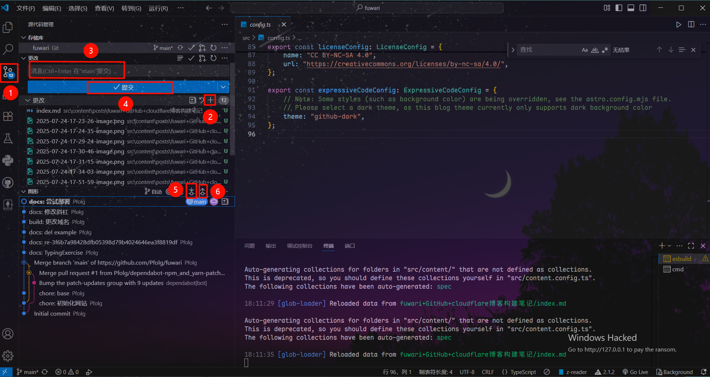

之后可以在GitHub看到刚刚的提交（有文件的更改才能提交哦）。

---

### 本地预览

使用命令`pnpm dev`，然后终端会不断跳出来一些信息：

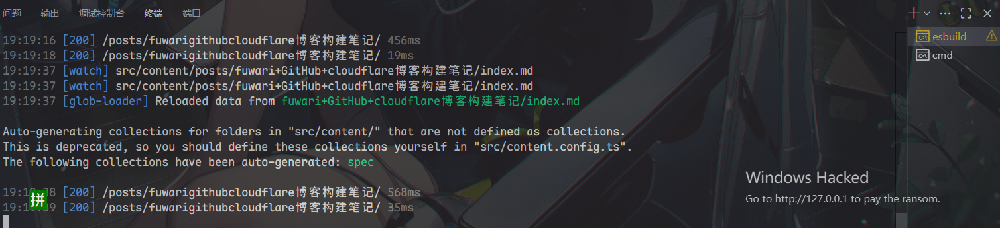

进入网站`localhost:4321`访问我们本地的博客：


---

### 发布到地球

如果你本地成功预览了，那可以开始发布了。

当然，这一步也是最磨人的，很多人都讲不明白。

> 如利用GitHub的deploy功能发布到\<username\>.github.io，我到现在都没整明白。

这里我们直接进入https://dash.cloudflare.com/ 注册一个账户，具体不细讲了。

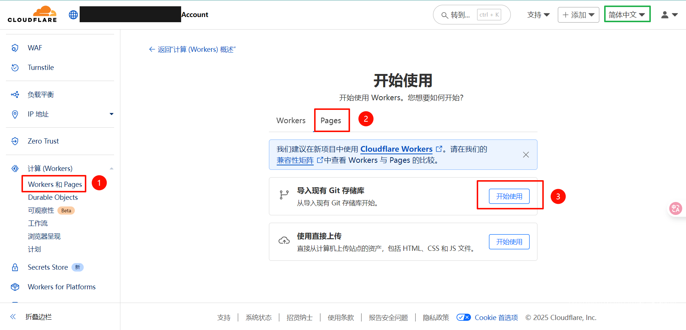

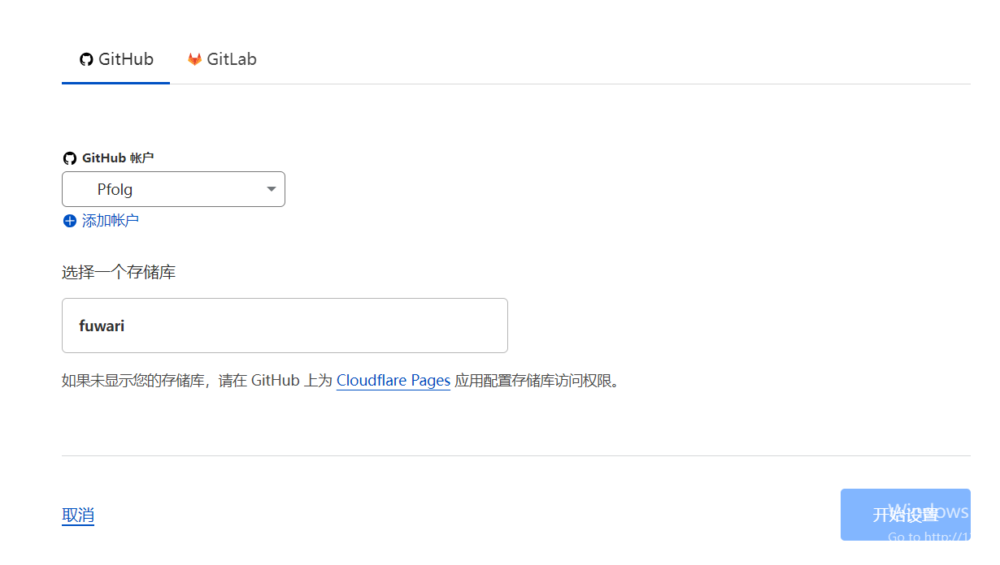

`保存并部署`

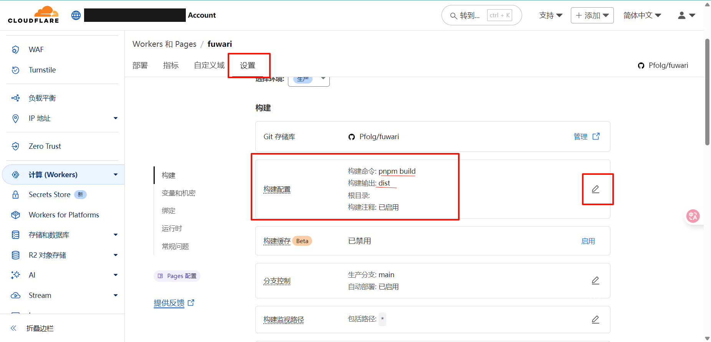

这里配置就完成了。

---

### 将域名添加到配置文件

点击访问获取域名：

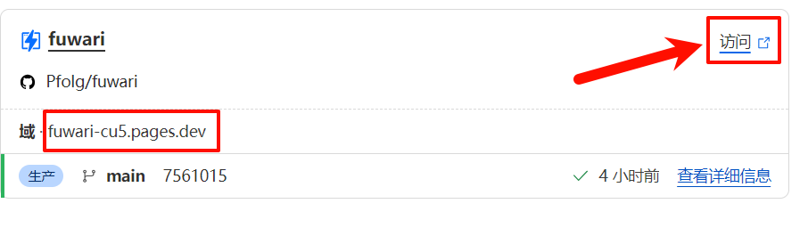

我这里是https://fuwari-cu5.pages.dev/ ，也就是这里的域，有条件的还可以自定义域名。

找到位于根目录的文件`astro.config.mjs`，修改：

```json

// https://astro.build/config
export default defineConfig({
	site: "https://fuwari-cu5.pages.dev/",//填入你的域名
	base: "/",
```

然后重新部署（提交）就完成了。

---

值得一提的是，这里的信息可能告诉了你这个方法确实能白嫖cloud flare的部署：


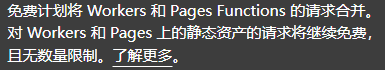

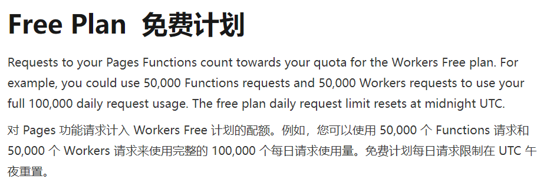

---

还有就是cloud flare有自动部署，只要你的仓库有更改，它就会执行部署，但仓库中如果含有影响部署的因素这会部署失败。

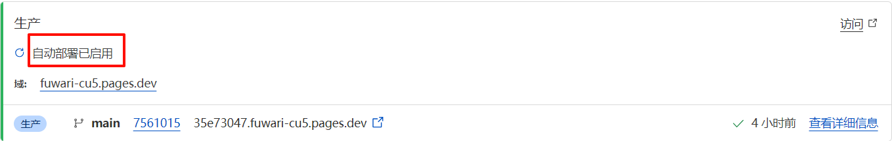

如图，艰辛的探索里程：

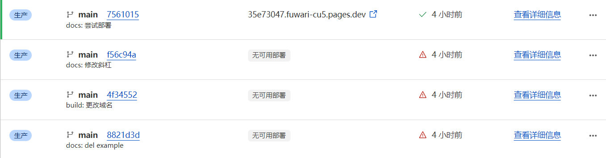

---

还有，如果不使用自定义域名的话，在国内应该是没办法访问的。

---

> **引用/可能有帮助的文章**
> 
> [Fuwari静态博客搭建教程 - 二叉树树的博客](https://www.afo.im/posts/fuwari/)
> 
> [fuwari/docs/README.zh-CN.md at main · saicaca/fuwari · GitHub](https://github.com/saicaca/fuwari/blob/main/docs/README.zh-CN.md)
> 
> [pnpm 基本详细使用教程（安装、卸载、使用、可能遇到的问题及解决办法）-CSDN博客](https://blog.csdn.net/m0_56416743/article/details/136122153)
> 
> [部署你的 Astro 站点至 GitHub Pages | Docs](https://docs.astro.build/zh-cn/guides/deploy/github/)
