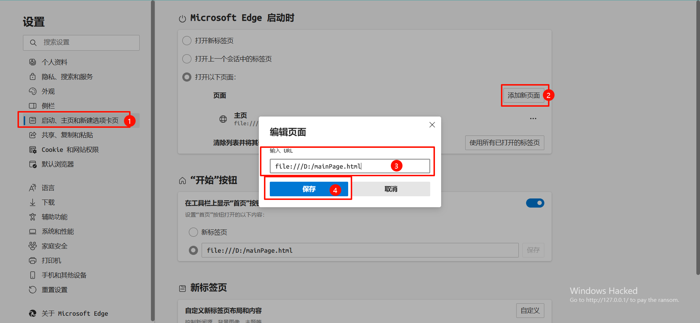

### 敲键盘的缘由

这是360浏览器的起始页

这是Edge的，还是优化后的，不然和360一样——满屏广告

可是360的无法通过一般设置改成Edge那样的。

### 那你问我

Q：怎么办？

~~A：摆！~~

A：自己动手，丰衣足食！

Look——

### 那你问我——怎么做？

那简单啊，其实只要有想法就行。

用JavaScript（其实我不会）写一个html文件出来，不会？把想要实现的想法给AI就行，让它帮你写：

这是DeepSeek帮我写的（作为一个开发者，改改代码还是可以的），以下代码实现的就是上面那种效果：
~~~html
<html lang="en">
<head>
    <meta charset="UTF-8">
    <meta name="viewport" content="width=device-width, initial-scale=1.0">
    
    <title>主页</title>
</head>
<body>
    
</body>
</html>
~~~
把这个html文件放到系统的某个位置

然后改一下浏览器的起始页：

设置到此结束，再麻烦360锁定一下主页，除了你，谁都不能再动你的主页啦！

如果你JavaScript比较强得话，在这个页面上实现一些功能也未尝不可。