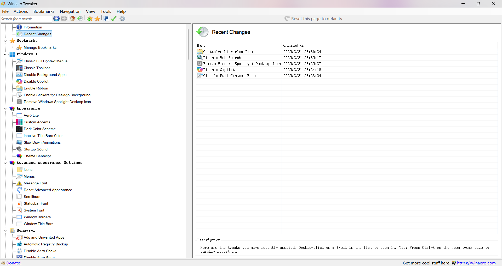

在个性化的道路上愈走愈远了……

### 关闭 Windows 11动画

打开设置搜索`性能`，点击`调整Windows的外观和性能`，

在以下页面进行配置：

如果你想电脑流畅一点，选择`调整为最佳性能(P)`，点击`应用`，Windows会变得流畅一点点（但是会变有点难看）；反之，选择`调整为最佳外观(B)`，Windows会变得好看一点。最后还是看个人选择。

我一般选择这两个：

OK，没了。

---

### 深度定制

如果再进一步的话，可以用 **[Winaero Tweaker](https://winaerotweaker.com/)** :

_至于这个软件是干什么的，可以问问AI_

"好像"没有中文，不过问题不大

---

美化的尽头是默认，但是默认不一定是最优的。
