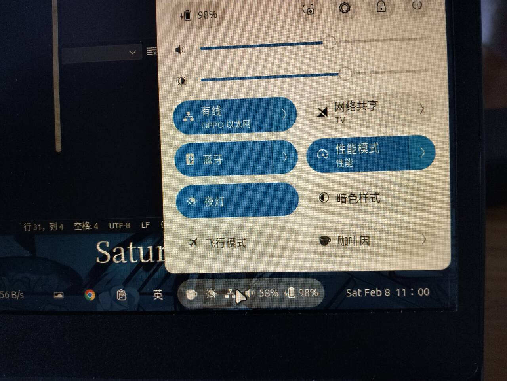
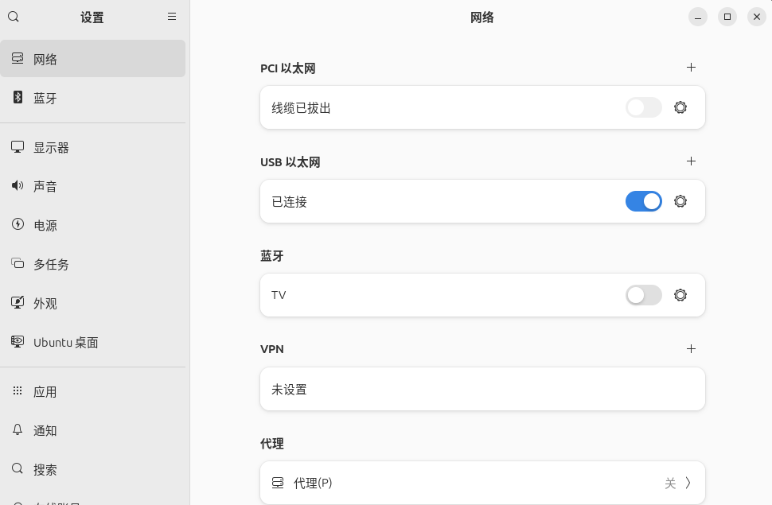
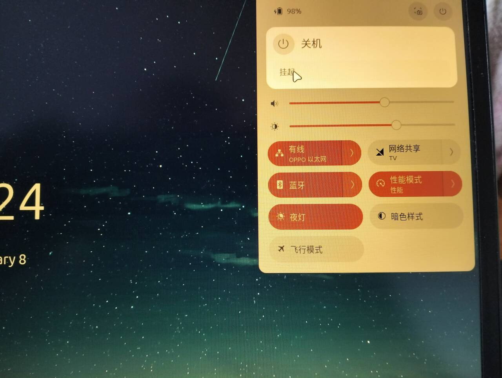
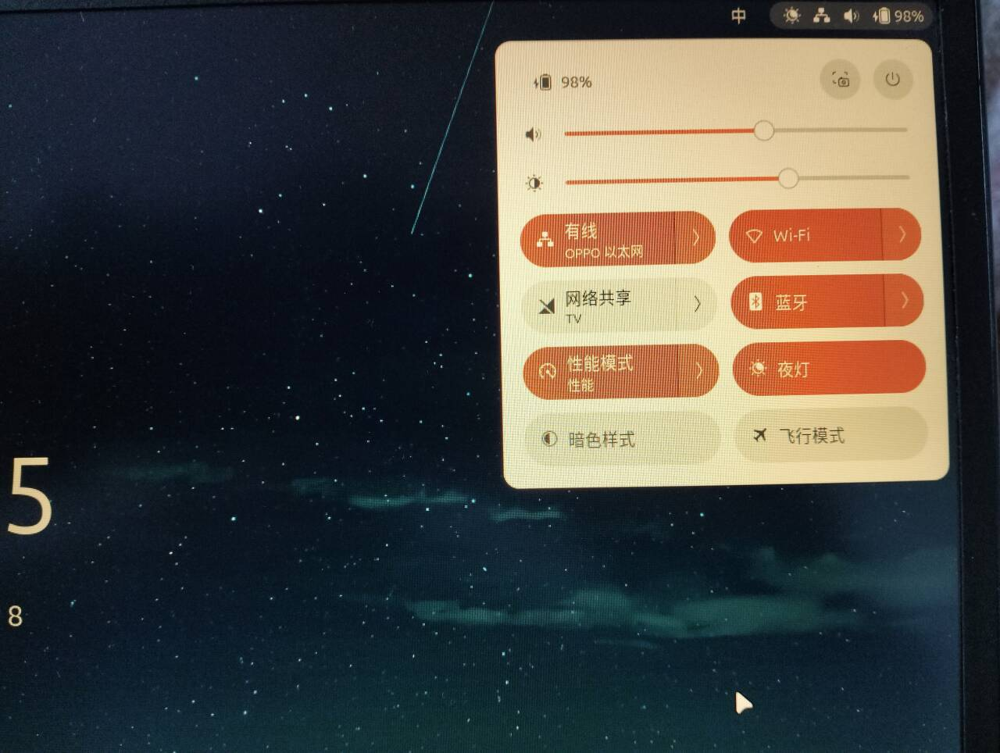
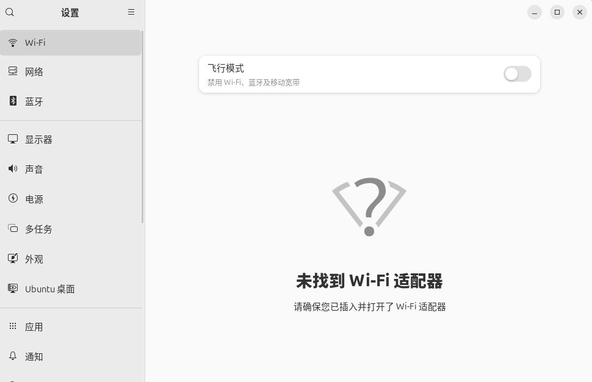

# 写在前面

本文中的操作可能对电脑造成一定的损害（未证实），本文最终所达到的效果目前作者无法给出科学的解释，如果有大佬知道，可以指点一下。本文中的命令大部分由AI给出。 **这个操作并非100%成功**

# 环境简介

```shell
pfolg@windows ~> uname -a
Linux windows 6.8.0-52-generic #53-Ubuntu SMP PREEMPT_DYNAMIC Sat Jan 11 00:06:25 UTC 2025 x86_64 x86_64 x86_64 GNU/Linux
```

## 报告详情（System）

- **生成日期：**                                        2025-02-08 10:57:26

## 硬件信息：

- **硬件型号：**                                        Intel NB01
- **内存：**                                          32.0 GiB
- **处理器：**                                         11th Gen Intel® Core™ i7-1185G7 × 8
- **显卡：**                                          NVIDIA GeForce MX450
- **显卡 1：**                                        NVIDIA GeForce MX450
- **磁盘容量：**                                        1.0 TB

## 软件信息：

- **固件版本：**                                        NB01.49
- **操作系统名称：**                                      Ubuntu 24.04.1 LTS
- **操作系统内部版本：**                                    (null)
- **操作系统类型：**                                      64 位
- **GNOME 版本：**                                    46
- **窗口系统：**                                        X11
- **内核版本：**                                        Linux 6.8.0-52-generic

## 网卡信息

此处参考了：[【新教程】Ubuntu server 24.04配置无线网WiFi](https://www.cnblogs.com/luk/p/18624859)

可以看到，我这里目前没有WiFI功能



使用以下命令查看网卡信息

```shell
lspci -nnk | grep -iA2 net
```

可以看到，我的Network controller是Intel Corporation Wireless 7265，表示系统能识别网卡

```shell
02:00.0 Network controller [0280]: Intel Corporation Wireless 7265 [8086:095a] (rev 59)
    Subsystem: Intel Corporation Dual Band Wireless-AC 7265 [Stone Peak 2 AC] [8086:5010]
    Kernel modules: iwlwifi
03:00.0 Ethernet controller [0200]: Realtek Semiconductor Co., Ltd. RTL8111/8168/8211/8411 PCI Express Gigabit Ethernet Controller [10ec:8168] (rev 15)
    Subsystem: Realtek Semiconductor Co., Ltd. RTL8111/8168/8411 PCI Express Gigabit Ethernet Controller [10ec:0123]
    Kernel driver in use: r8169
    Kernel modules: r8169
```

查看无线网卡名称，一般wl开头的为无线网卡，但是我这里没有。

```
ip addr
```

```shell
1: lo: <LOOPBACK,UP,LOWER_UP> mtu 65536 qdisc noqueue state UNKNOWN group default qlen 1000
    link/loopback 00:00:00:00:00:00 brd 00:00:00:00:00:00
    inet 127.0.0.1/8 scope host lo
       valid_lft forever preferred_lft forever
    inet6 ::1/128 scope host noprefixroute 
       valid_lft forever preferred_lft forever
2: enp3s0: <NO-CARRIER,BROADCAST,MULTICAST,UP> mtu 1500 qdisc fq_codel state DOWN group default qlen 1000
    link/ether 00:e0:4d:68:97:60 brd ff:ff:ff:ff:ff:ff
3: vmnet1: <BROADCAST,MULTICAST,UP,LOWER_UP> mtu 1500 qdisc fq_codel state UNKNOWN group default qlen 1000
    link/ether 00:50:56:c0:00:01 brd ff:ff:ff:ff:ff:ff
    inet 192.168.74.1/24 brd 192.168.74.255 scope global vmnet1
       valid_lft forever preferred_lft forever
    inet6 fe80::250:56ff:fec0:1/64 scope link 
       valid_lft forever preferred_lft forever
4: vmnet8: <BROADCAST,MULTICAST,UP,LOWER_UP> mtu 1500 qdisc fq_codel state UNKNOWN group default qlen 1000
    link/ether 00:50:56:c0:00:08 brd ff:ff:ff:ff:ff:ff
    inet 192.168.80.1/24 brd 192.168.80.255 scope global vmnet8
       valid_lft forever preferred_lft forever
    inet6 fe80::250:56ff:fec0:8/64 scope link 
       valid_lft forever preferred_lft forever
5: enxd2143b5c26f3: <BROADCAST,MULTICAST,UP,LOWER_UP> mtu 1500 qdisc fq_codel state UNKNOWN group default qlen 1000
    link/ether d2:14:3b:5c:26:f3 brd ff:ff:ff:ff:ff:ff
    inet 192.168.3.150/24 brd 192.168.3.255 scope global dynamic noprefixroute enxd2143b5c26f3
       valid_lft 2866sec preferred_lft 2866sec
    inet6 2409:8962:5c66:a4c:938e:989c:7654:2dc1/64 scope global temporary dynamic 
       valid_lft 6825sec preferred_lft 6825sec
    inet6 2409:8962:5c66:a4c:27db:2897:1945:b236/64 scope global dynamic mngtmpaddr noprefixroute 
       valid_lft 6825sec preferred_lft 6825sec
    inet6 fe80::a3e9:61ce:1e7:fe0c/64 scope link noprefixroute 
       valid_lft forever preferred_lft forever
```

那么，问题来了，系统能识别网卡，但是不能加载！

# 玄学（目前）

## 准备工作

使用以下命令更新系统&软件

```shell
sudo apt update
sudo apt upgrade
```

这个命令会自动检测并安装适合你硬件的最佳驱动程序。

```
sudo ubuntu-drivers autoinstall
```

nmcli 是 NetworkManager 的命令行工具，可以用来查看和管理网络连接

```
nmcli device status
```

```
DEVICE             TYPE      STATE         CONNECTION 
enxd2143b5c26f3    ethernet  已连接        有线连接 2 
lo                 loopback  连接（外部）  lo         
2C:D9:74:38:37:EA  bt        已断开        --         
enp3s0             ethernet  不可用        --         
vmnet1             ethernet  未托管        --         
vmnet8             ethernet  未托管        --    
```

检查发现还是没有WiFi功能



## 检查ubuntu系统日志

使用以下命令检查与无线网络相关的日志

```shell
sudo dmesg | grep iwlwifi
```

```shell
[   74.870651] iwlwifi 0000:02:00.0: Unable to change power state from D3cold to D0, device inaccessible
[   74.930689] iwlwifi 0000:02:00.0: Unable to change power state from D3cold to D0, device inaccessible
[   74.930822] iwlwifi 0000:02:00.0: HW_REV=0xFFFFFFFF, PCI issues?
[   74.930831] iwlwifi: probe of 0000:02:00.0 failed with error -5
```

AI：根据您提供的系统日志信息，您的无线网卡（iwlwifi 驱动）出现了无法更改电源状态的问题，导致设备无法访问。这通常与电源管理、驱动程序或硬件问题有关。

## AI给的解决方法（参考而不实操）

根据您提供的系统日志信息，您的无线网卡（iwlwifi 驱动）出现了无法更改电源状态的问题，导致设备无法访问。这通常与电源管理、驱动程序或硬件问题有关。以下是一些可能的解决方案，您可以根据具体情况尝试：

### 1. **检查硬件连接**

首先，确保无线网卡的硬件连接没有问题：

- **笔记本电脑用户**：尝试重新插拔无线网卡（如果可以拆卸），或者联系制造商以确认硬件是否正常工作。
- **台式机用户**：确保无线网卡正确插入PCIe插槽，并且没有松动。

### 2. **更新系统并安装最新的驱动程序**

确保您的系统和驱动程序是最新的：

```bash
sudo apt update
sudo apt upgrade
sudo ubuntu-drivers autoinstall
```

这将更新系统软件包并安装适合您硬件的最新驱动程序。

### 3. **禁用电源管理**

有时，电源管理设置可能导致无线网卡无法正常工作。您可以尝试禁用电源管理：

#### 方法一：使用 `iwlwifi` 模块参数

1. 打开或创建 `/etc/modprobe.d/iwlwifi.conf` 文件：
   
   ```bash
   sudo nano /etc/modprobe.d/iwlwifi.conf
   ```

2. 添加以下行以禁用电源管理：
   
   ```
   options iwlwifi power_save=0
   ```

3. 保存并关闭文件，然后重新加载 `iwlwifi` 模块：
   
   ```bash
   sudo modprobe -r iwlwifi
   sudo modprobe iwlwifi
   ```

#### 方法二：使用 `systemd` 配置

1. 创建一个 `systemd` 覆盖文件：
   
   ```bash
   sudo nano /etc/systemd/system/disable-wifi-pm.service
   ```

2. 添加以下内容：
   
   ```ini
   [Unit]
   Description=Disable WiFi Power Management
   
   [Service]
   Type=oneshot
   ExecStart=/sbin/iw dev wlan0 set power_save off
   
   [Install]
   WantedBy=multi-user.target
   ```
   
   > **注意**：确保 `wlan0` 是您的无线网卡接口名称。您可以使用 `ip link` 命令确认。

3. 保存并关闭文件，然后启用并启动服务：
   
   ```bash
   sudo systemctl enable disable-wifi-pm.service
   sudo systemctl start disable-wifi-pm.service
   ```

### 4. **重新安装 `iwlwifi` 驱动程序**

有时，重新安装驱动程序可以解决问题：

1. 卸载当前的 `iwlwifi` 模块：
   
   ```bash
   sudo modprobe -r iwlwifi
   ```

2. 重新安装 `iwlwifi` 模块：
   
   ```bash
   sudo modprobe iwlwifi
   ```

### 5. **检查 BIOS/UEFI 设置**

某些 BIOS/UEFI 设置可能会影响无线网卡的电源状态：

- **禁用节能模式**：进入 BIOS/UEFI 设置，检查是否有节能模式或电源管理选项，尝试禁用它们。
- **启用 PCIe 电源管理**：有时，启用 PCIe 电源管理可以解决一些问题。

### 6. **检查系统日志以获取更多信息**

使用 `journalctl` 查看更多相关日志，以获取更多诊断信息：

```bash
sudo journalctl -xe
```

查看是否有其他相关的错误信息，这可以帮助进一步诊断问题。

### 7. **尝试不同的内核版本**

有时，内核版本的问题可能导致驱动程序无法正常工作。您可以尝试使用不同的内核版本：

1. 查看可用的内核版本：
   
   ```bash
   sudo apt-cache search linux-image
   ```

2. 安装一个较新的内核版本，例如：
   
   ```bash
   sudo apt install linux-image-generic
   ```

3. 更新启动加载器并重启：
   
   ```bash
   sudo update-grub
   sudo reboot
   ```

### 8. **联系硬件制造商或寻求社区支持**

如果以上方法都无法解决问题，建议联系无线网卡的硬件制造商，或者在Ubuntu社区和相关论坛寻求帮助。提供详细的系统日志和硬件信息可以帮助他人更好地诊断问题。

### 总结

无线网卡的问题可能由多种因素引起，包括硬件、驱动程序、电源管理和系统配置。通过逐步排查和尝试上述方法，您应该能够找到问题的根源并解决它。如果问题依然存在，寻求专业的技术支持可能是必要的。

## 操作（目前作者无法解释这部分）

**它可能与电源相关。**

- 按下super+L （win+L）锁定电脑（可以不锁）
  
  然后查看系统菜单中，目前没有WiFi标识
  

- 点击系统菜单中的电源按钮，点击挂起，等待10s左右，然后打开屏幕，检查系统菜单

- 
  
  可以看到，目前wifi功能出现，是否有效待定
  

  只要键盘上面的第三个标志（wifi）亮了即表示成功（不一定，连接了wifi可能才亮，失败了）
  
  
  

# 总结

本方法实在是低效，作者也曾浏览过各大网站，但是目前还是没找到解决方法，应该是硬件问题。

没事，作者的无线网卡已经在路上了。

谢谢！