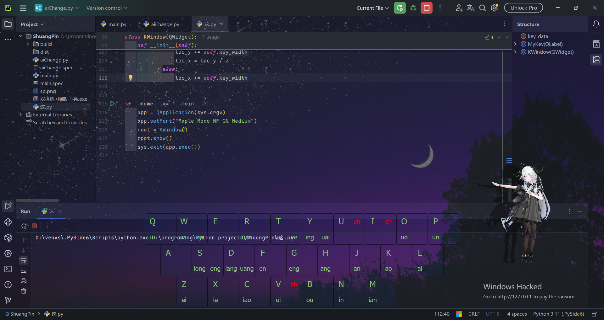
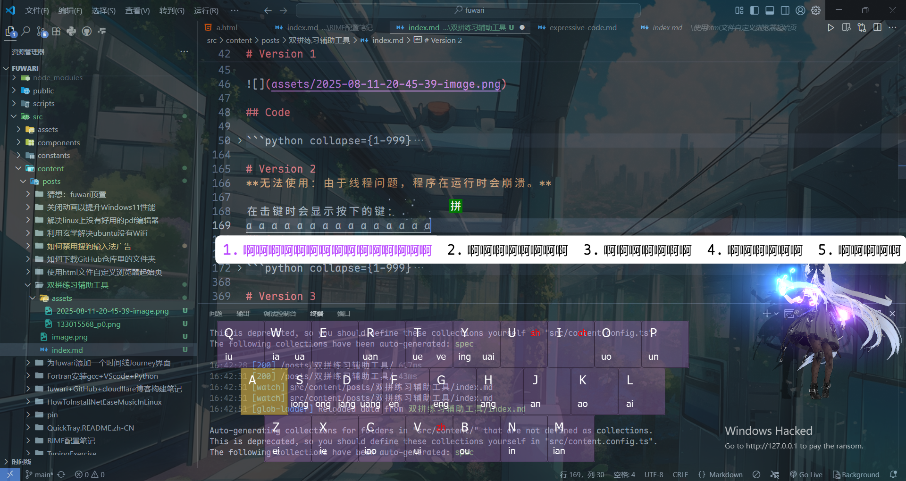
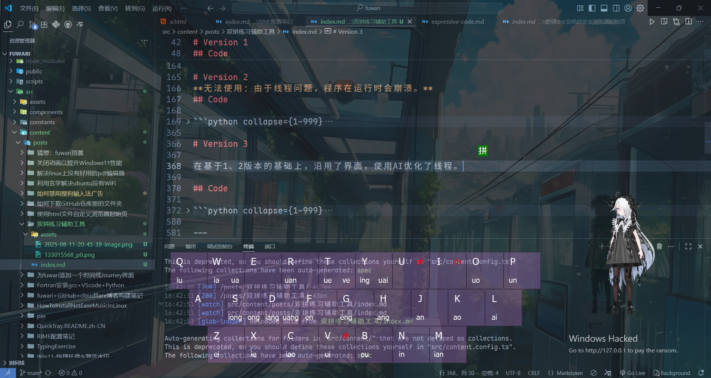

> [!NOTE]
> _Cover from [都市シリーズ(City Series) - 17](https://www.pixiv.net/artworks/133015568)_

# Why Write？

### 什么是双拼？

**双拼**是一种高效的中文拼音输入法，通过 **两次按键** 输入一个汉字：  
- **第一键** 代表 **声母**（如 `sh`、`ch` 等复合声母对应单键）；  
- **第二键** 代表 **韵母**（如 `ang`、`iong` 等对应单键）。  

**特点**：  
1. **输入快**（比全拼按键少）；  
2. **需记忆**（键位对应声母/韵母）；  
3. **多种方案**（如小鹤双拼、微软双拼等）。  

**举例**（小鹤双拼）：  
- “双” = `u`（声母 `sh`） + `l`（韵母 `uang`） → 按 `u` 和 `l` 两键。  

适合追求输入效率的用户，但需短期学习适应。

### 为什么写？

然而，我又没有能显示双拼提示的键盘，也不能放一张不透明的图在屏幕上。

于是，灵机一动的我就用Python写了一个程序，用来提示我该敲哪个键。

我也想通过这篇文章练习双拼，于是乎，敲了很久……

# Version 1

>[!NOTE]
>显示一个界面，引导用户如何使用双拼——如何击键。

比如 **“上” shang** 字，就要把它拆成 `sh (U)`和`ang (H)`。



## Code

```python collapse={1-999}
# -*- coding: UTF-8 -*-
"""
PROJECT_NAME ShuangPin
PRODUCT_NAME PyCharm
NAME main
AUTHOR Pfolg
TIME 2025/8/10 16:59
"""
import sys

from PySide6.QtCore import Qt
from PySide6.QtGui import QFont
from PySide6.QtWidgets import QLabel, QWidget, QApplication, QFrame

key_data = {
    # 自然码
    "Q": ["", "iu", ""],
    "W": ["", "ia", "ua"],
    "E": ["", "", ""],
    "R": ["", "uan", ""],
    "T": ["", "ue", "ve"],
    "Y": ["", "ing", "uai"],
    "U": ["sh", "", ""],
    "I": ["ch", "", ""],
    "O": ["", "uo", ""],
    "P": ["", "un", ""],
    # ---
    "A": ["", "", ""],
    "S": ["", "iong", "ong"],
    "D": ["", "iang", "uang"],
    "F": ["", "en", ""],
    "G": ["", "eng", ""],
    "H": ["", "ang", ""],
    "J": ["", "an", ""],
    "K": ["", "ao", ""],
    "L": ["", "ai", ""],
    # ---
    "Z": ["", "ei", ""],
    "X": ["", "ie", ""],
    "C": ["", "iao", ""],
    "V": ["zh", "ui", ""],
    "B": ["", "ou", ""],
    "N": ["", "in", ""],
    "M": ["", "ian", ""],
}


class MyKey(QLabel):
    def __init__(self, x: int, y: int, main_key: str, func_key: str, k1: str, k2: str, w=80):
        super().__init__()
        self.setGeometry(x, y, w, w)
        self.main_key = QLabel(main_key, self)
        self.func_key = QLabel(func_key, self)
        self.func_key.setStyleSheet("color:red;")
        self.k1 = QLabel(k1, self)
        self.k2 = QLabel(k2, self)
        font = QFont()
        font.setPointSize(16)
        self.main_key.setFont(font)
        self.setFrameShape(QFrame.Shape.Box)
        # 位置
        self.main_key.setGeometry(0, 0, int(w / 2), int(w / 2))
        self.func_key.setGeometry(int(w / 2), 0, int(w / 2), int(w / 2))
        self.k1.setGeometry(0, int(w / 2), int(w / 2), int(w / 2))
        self.k2.setGeometry(int(w / 2), int(w / 2), int(w / 2), int(w / 2))
        # 样式
        self.main_key.setAlignment(Qt.AlignmentFlag.AlignCenter)
        self.func_key.setAlignment(Qt.AlignmentFlag.AlignCenter)
        self.k1.setAlignment(Qt.AlignmentFlag.AlignCenter)
        self.k2.setAlignment(Qt.AlignmentFlag.AlignCenter)
        self.setStyleSheet("color:#89ca78;background-color:rgba(12, 49, 110, 20)")

        # 字体
        font.setPointSize(12)
        self.func_key.setFont(font)
        self.k1.setFont(font)
        self.k2.setFont(font)


class KWindow(QWidget):
    def __init__(self):
        super().__init__()
        # 10*20*3 |-10 9*20 |-20 7*20 # 20->60px
        self.key_width = 80
        sw, sh = app.primaryScreen().geometry().width(), app.primaryScreen().geometry().height()
        w, h = 10 * self.key_width, 3 * self.key_width
        self.setGeometry(int((sw - w) / 2), int(sh - h - self.key_width), w, h)
        self.setWindowFlags(
            Qt.WindowType.FramelessWindowHint |
            Qt.WindowType.WindowTransparentForInput |
            Qt.WindowType.ToolTip |
            Qt.WindowType.WindowStaysOnTopHint)
        self.setAttribute(Qt.WidgetAttribute.WA_TranslucentBackground)
        key_keys = list(key_data.keys())
        loc_x, loc_y = 0, 0
        for i in range(len(key_keys)):
            k = key_keys[i]
            a = MyKey(loc_x, loc_y, k, key_data.get(k)[0], key_data.get(k)[1], key_data.get(k)[2])
            a.setParent(self)
            if i == 9 or i == 18:
                loc_y += self.key_width
                loc_x = loc_y / 2
            else:
                loc_x += self.key_width


if __name__ == '__main__':
    app = QApplication(sys.argv)
    app.setFont("Maple Mono NF CN Medium")
    root = KWindow()
    root.show()
    sys.exit(app.exec())
```

# Version 2

>[!WARNING]
>无法使用：由于线程问题，程序在运行时会崩溃。

>[!NOTE]
>在击键时显示按下的键。



## Code

```python collapse={1-999}
# -*- coding: UTF-8 -*-
"""
PROJECT_NAME ShuangPin
PRODUCT_NAME PyCharm
NAME main
AUTHOR Pfolg
TIME 2025/8/10 16:59
"""
import os
import socket
import sys

from PySide6.QtCore import Qt
from PySide6.QtGui import QFont, QAction, QIcon
from PySide6.QtWidgets import QLabel, QWidget, QApplication, QFrame, QSystemTrayIcon, QMenu
from pynput import keyboard

"""pyinstaller --onefile --windowed --add-data "sp.png;." main.py"""


def resource_path(relative_path):
    """获取资源的绝对路径（兼容开发环境和打包后环境）"""
    if hasattr(sys, '_MEIPASS'):
        return os.path.join(sys._MEIPASS, relative_path)
    return os.path.join(os.path.abspath("."), relative_path)


logo = resource_path("sp.png")

# 使用示例
ui_path = resource_path("typing.ui")
key_data = {
    # 自然码
    "Q": ["", "iu", ""],
    "W": ["", "ia", "ua"],
    "E": ["", "", ""],
    "R": ["", "uan", ""],
    "T": ["", "ue", "ve"],
    "Y": ["", "ing", "uai"],
    "U": ["sh", "", ""],
    "I": ["ch", "", ""],
    "O": ["", "uo", ""],
    "P": ["", "un", ""],
    # ---
    "A": ["", "", ""],
    "S": ["", "iong", "ong"],
    "D": ["", "iang", "uang"],
    "F": ["", "en", ""],
    "G": ["", "eng", ""],
    "H": ["", "ang", ""],
    "J": ["", "an", ""],
    "K": ["", "ao", ""],
    "L": ["", "ai", ""],
    # ---
    "Z": ["", "ei", ""],
    "X": ["", "ie", ""],
    "C": ["", "iao", ""],
    "V": ["zh", "ui", ""],
    "B": ["", "ou", ""],
    "N": ["", "in", ""],
    "M": ["", "ian", ""],
}


class MyKey(QLabel):
    def __init__(self, x: int, y: int, main_key: str, func_key: str, k1: str, k2: str, w=80):
        super().__init__()
        self.setGeometry(x, y, w, w)
        self.main_key = QLabel(main_key, self)
        self.func_key = QLabel(func_key, self)
        self.func_key.setStyleSheet("color:red;")
        self.k1 = QLabel(k1, self)
        self.k2 = QLabel(k2, self)
        font = QFont()
        font.setPointSize(16)
        self.main_key.setFont(font)
        self.setFrameShape(QFrame.Shape.Box)
        # 位置
        self.main_key.setGeometry(0, 0, int(w / 2), int(w / 2))
        self.func_key.setGeometry(int(w / 2), 0, int(w / 2), int(w / 2))
        self.k1.setGeometry(0, int(w / 2), int(w / 2), int(w / 2))
        self.k2.setGeometry(int(w / 2), int(w / 2), int(w / 2), int(w / 2))
        # 样式
        self.main_key.setAlignment(Qt.AlignmentFlag.AlignCenter)
        self.func_key.setAlignment(Qt.AlignmentFlag.AlignCenter)
        self.k1.setAlignment(Qt.AlignmentFlag.AlignCenter)
        self.k2.setAlignment(Qt.AlignmentFlag.AlignCenter)
        self.setStyleSheet(
            "color:#ffffff;"
            "background-color:rgba(12, 49, 110, 20)"
        )

        # 字体
        font.setPointSize(12)
        self.func_key.setFont(font)
        self.k1.setFont(font)
        self.k2.setFont(font)


class KWindow(QWidget):
    def __init__(self):
        super().__init__()
        # 10*20*3 |-10 9*20 |-20 7*20 # 20->60px
        self.key_width = 80
        sw, sh = app.primaryScreen().geometry().width(), app.primaryScreen().geometry().height()
        w, h = 10 * self.key_width, 3 * self.key_width
        self.setGeometry(int((sw - w) / 2), int(sh - h - self.key_width), w, h)
        self.setWindowFlags(
            Qt.WindowType.FramelessWindowHint |
            Qt.WindowType.WindowTransparentForInput |
            Qt.WindowType.ToolTip |
            Qt.WindowType.WindowStaysOnTopHint)
        self.setAttribute(Qt.WidgetAttribute.WA_TranslucentBackground)
        key_keys = list(key_data.keys())
        loc_x, loc_y = 0, 0
        for i in range(len(key_keys)):
            k = key_keys[i]
            a = MyKey(loc_x, loc_y, k, key_data.get(k)[0], key_data.get(k)[1], key_data.get(k)[2])
            a.setObjectName(k)
            a.setParent(self)
            if i == 9 or i == 18:
                loc_y += self.key_width
                loc_x = loc_y / 2
            else:
                loc_x += self.key_width

        self.keyboardListener = keyboard.Listener(on_press=self.on_key_press, on_release=self.on_key_release)
        self.keyboardListener.start()

    @staticmethod
    def on_key_press(key):
        """处理键盘按下事件"""
        try:
            # 处理普通按键
            key_name = key.char.upper()
            print(key_name)
            k: MyKey = root.findChild(MyKey, key_name)
            k.setStyleSheet(
                "color:#ffffff;"
                "background-color:rgba(255, 208, 75, 80);"
            )
        except Exception as e:
            print(str(e))
            return

    @staticmethod
    def on_key_release(key):
        """处理键盘释放事件"""
        try:
            # 处理普通按键
            key_name = key.char.upper()
            print(key_name)
            k: MyKey = root.findChild(MyKey, key_name)
            k.setStyleSheet(
                "color:#ffffff;"
                "background-color:rgba(12, 49, 110, 20)"
            )
        except Exception as e:
            print(str(e))
            return


def single_instance(port: int):
    try:
        # 选择一个不常用的端口
        sock = socket.socket(socket.AF_INET, socket.SOCK_STREAM)
        sock.bind(("127.0.0.1", port))
    except socket.error:
        print("另一个实例正在运行，退出。")
        sys.exit(1)
    return sock


class Tray(QSystemTrayIcon):
    def __init__(self):
        super().__init__()
        self.menu = QMenu()
        ac_q = QAction("Quit", self.menu)
        ac_q.triggered.connect(sys.exit)
        self.menu.addAction(ac_q)
        self.setContextMenu(self.menu)
        self.setIcon(QIcon(logo))
        self.setToolTip("双拼练习辅助工具")
        self.show()


if __name__ == '__main__':
    app = QApplication(sys.argv)
    app.setFont("Maple Mono NF CN Medium")
    root = KWindow()
    root.show()
    t = Tray()
    ins = single_instance(7086)
    sys.exit(app.exec())
```

# Version 3
>[!NOTE]
>在基于1、2版本的基础上，沿用了界面，使用AI优化了线程。



## Code

```python collapse={1-999}
# -*- coding: UTF-8 -*-
import os
import socket
import sys

from PySide6.QtCore import Qt, QThread, Signal
from PySide6.QtGui import QFont, QAction, QIcon
from PySide6.QtWidgets import QLabel, QWidget, QApplication, QFrame, QSystemTrayIcon, QMenu
from pynput import keyboard


def resource_path(relative_path):
    if hasattr(sys, '_MEIPASS'):
        return os.path.join(sys._MEIPASS, relative_path)
    return os.path.join(os.path.abspath("."), relative_path)


logo = resource_path("sp.png")

key_data = {
    # 自然码
    "Q": ["", "iu", ""],
    "W": ["", "ia", "ua"],
    "E": ["", "", ""],
    "R": ["", "uan", ""],
    "T": ["", "ue", "ve"],
    "Y": ["", "ing", "uai"],
    "U": ["sh", "", ""],
    "I": ["ch", "", ""],
    "O": ["", "uo", ""],
    "P": ["", "un", ""],
    # ---
    "A": ["", "", ""],
    "S": ["", "iong", "ong"],
    "D": ["", "iang", "uang"],
    "F": ["", "en", ""],
    "G": ["", "eng", ""],
    "H": ["", "ang", ""],
    "J": ["", "an", ""],
    "K": ["", "ao", ""],
    "L": ["", "ai", ""],
    # ---
    "Z": ["", "ei", ""],
    "X": ["", "ie", ""],
    "C": ["", "iao", ""],
    "V": ["zh", "ui", ""],
    "B": ["", "ou", ""],
    "N": ["", "in", ""],
    "M": ["", "ian", ""],
}


class KeyboardListener(QThread):
    key_pressed = Signal(str)
    key_released = Signal(str)

    def run(self):
        with keyboard.Listener(
                on_press=self.on_press,
                on_release=self.on_release
        ) as listener:
            listener.join()

    def on_press(self, key):
        try:
            if hasattr(key, 'char') and key.char:
                self.key_pressed.emit(key.char.upper())
        except Exception as e:
            print(f"Press error: {e}")

    def on_release(self, key):
        try:
            if hasattr(key, 'char') and key.char:
                self.key_released.emit(key.char.upper())
        except Exception as e:
            print(f"Release error: {e}")


class MyKey(QLabel):
    def __init__(self, x: int, y: int, main_key: str, func_key: str, k1: str, k2: str, w=80):
        super().__init__()
        self.setGeometry(x, y, w, w)
        self.main_key = QLabel(main_key, self)
        self.func_key = QLabel(func_key, self)
        self.func_key.setStyleSheet("color:red;")
        self.k1 = QLabel(k1, self)
        self.k2 = QLabel(k2, self)
        font = QFont()
        font.setPointSize(16)
        self.main_key.setFont(font)
        self.setFrameShape(QFrame.Shape.Box)

        self.main_key.setGeometry(0, 0, int(w / 2), int(w / 2))
        self.func_key.setGeometry(int(w / 2), 0, int(w / 2), int(w / 2))
        self.k1.setGeometry(0, int(w / 2), int(w / 2), int(w / 2))
        self.k2.setGeometry(int(w / 2), int(w / 2), int(w / 2), int(w / 2))

        self.main_key.setAlignment(Qt.AlignmentFlag.AlignCenter)
        self.func_key.setAlignment(Qt.AlignmentFlag.AlignCenter)
        self.k1.setAlignment(Qt.AlignmentFlag.AlignCenter)
        self.k2.setAlignment(Qt.AlignmentFlag.AlignCenter)

        self.setStyleSheet(
            "color:#ffffff;"
            "background-color:rgba(171, 111, 200, 50)"
        )

        font.setPointSize(12)
        self.func_key.setFont(font)
        self.k1.setFont(font)
        self.k2.setFont(font)


class KWindow(QWidget):
    def __init__(self):
        super().__init__()
        self.key_width = 80
        screen = QApplication.primaryScreen().geometry()
        w, h = 10 * self.key_width, 3 * self.key_width
        self.setGeometry(
            int((screen.width() - w) / 2),
            int(screen.height() - h - self.key_width),
            w, h
        )
        self.setWindowFlags(
            Qt.WindowType.FramelessWindowHint |
            Qt.WindowType.WindowTransparentForInput |
            Qt.WindowType.ToolTip |
            Qt.WindowType.WindowStaysOnTopHint
        )
        self.setAttribute(Qt.WidgetAttribute.WA_TranslucentBackground)

        key_keys = list(key_data.keys())
        loc_x, loc_y = 0, 0
        for i, k in enumerate(key_keys):
            a = MyKey(loc_x, loc_y, k, key_data[k][0], key_data[k][1], key_data[k][2], self.key_width)
            a.setParent(self)
            a.setObjectName(k)

            if i in [9, 18]:  # 行尾换行
                loc_y += self.key_width
                loc_x = loc_y / 2
            else:
                loc_x += self.key_width

        # 创建并启动键盘监听线程
        self.listener_thread = KeyboardListener()
        self.listener_thread.key_pressed.connect(self.handle_key_press)
        self.listener_thread.key_released.connect(self.handle_key_release)
        self.listener_thread.start()

    def handle_key_press(self, key_name):
        """处理按键按下事件（UI线程安全）"""
        key_widget = self.findChild(MyKey, key_name)
        if key_widget:
            key_widget.setStyleSheet(
                "color:#ffffff;"
                "background-color:rgba(255, 208, 75, 80);"
            )

    def handle_key_release(self, key_name):
        """处理按键释放事件（UI线程安全）"""
        key_widget = self.findChild(MyKey, key_name)
        if key_widget:
            key_widget.setStyleSheet(
                "color:#ffffff;"
                "background-color:rgba(171, 111, 200, 50)"
            )


class Tray(QSystemTrayIcon):
    def __init__(self):
        super().__init__()
        self.menu = QMenu()
        ac_q = QAction("退出", self.menu)
        ac_q.triggered.connect(sys.exit)
        self.menu.addAction(ac_q)
        self.setContextMenu(self.menu)
        self.setIcon(QIcon(logo))
        self.setToolTip("双拼练习辅助工具")
        self.show()


def single_instance(port: int):
    try:
        sock = socket.socket(socket.AF_INET, socket.SOCK_STREAM)
        sock.bind(("127.0.0.1", port))
        return sock
    except socket.error:
        print("另一个实例正在运行，退出。")
        sys.exit(1)


if __name__ == '__main__':
    app = QApplication(sys.argv)
    app.setFont("Maple Mono NF CN Medium")

    # 确保单实例运行
    instance_lock = single_instance(7086)

    window = KWindow()
    window.show()

    tray = Tray()

    sys.exit(app.exec())
```

---

> [!NOTE]
> **Cover**
> 
> ASJC 最も人気のあるの日本語曲《I Miss You》がリリースされ、
>以下のプラットフォームで聴くことができます。
>
>Full MV : https://youtu.be/Eur8P7Nku9A
>
>KKBOX : https://kkbox.fm/VaIRl5
>
>YT Music : https://music.youtube.com/playlist?list=OLAK5uy_nRhhgO2VyOwqw6bxWBFkg9QhaguIqrQsI
>
>Spotify : https://open.spotify.com/album/4HPurCZhsb6suc2aRUZPMa
>
>Apple Music : https://music.apple.com/album/1799128465
>
>Amazon : https://music.amazon.co.uk/albums/B0DDRND9ZW?marketplaceId=A1F83G8C2ARO7P&musicTerritory=GB&>ref=dm_sh_epFPtLDjZPO0uoG0NW5VPFXuh
>
>「ASJC is available now on Spotify、Amazon Music、Apple Music、Youtube Music、KKBOX 」