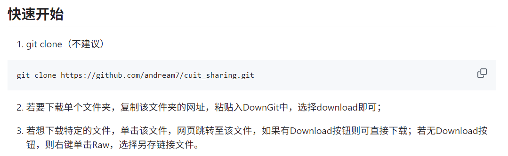
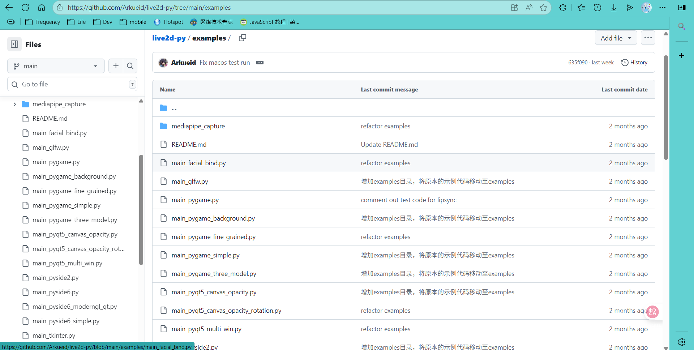
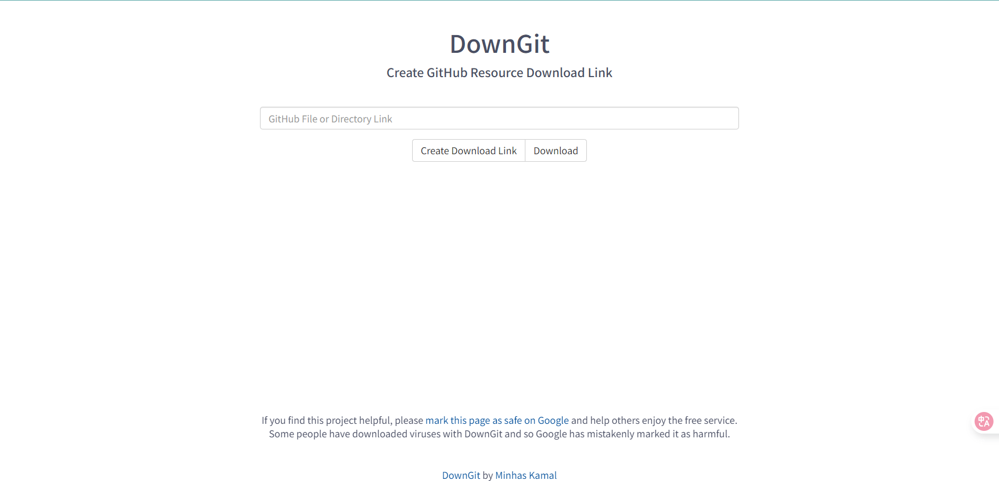
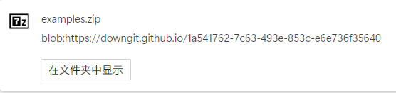

> _cover from https://www.pixiv.net/artworks/133051243_

# 直接看懂

非常简单:

from: 
::github{repo="andream7/cuit_sharing"}

# 实操一遍

进入我们想下载的文件夹：

在地址栏复制链接，然后go: _https://downgit.github.io/#/home_

粘贴链接然后点download，下载的文件夹会以压缩包的形式下载到您的电脑上：

# 最后

虽然这个方法简单，但是鲜为人知，只有在不断的探索中才能丰富自己的知识，找到适合自己的解决方法。

~~GitHub冲浪腻了来水一篇文章~~