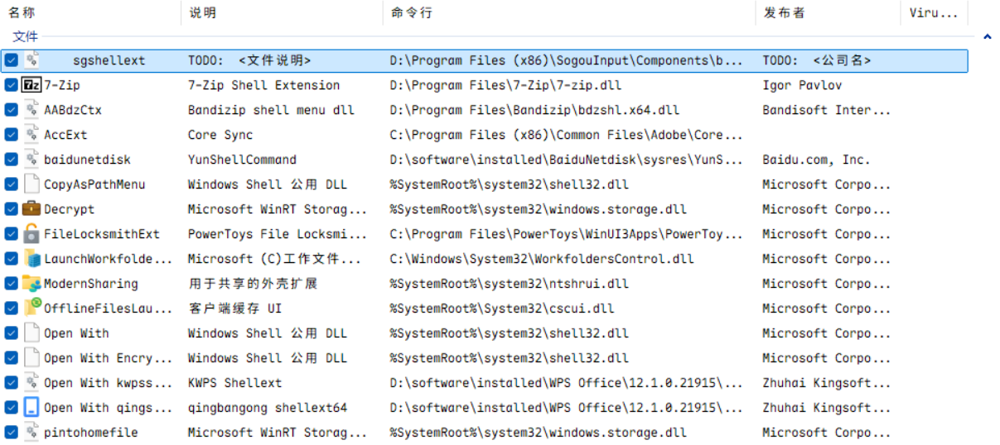
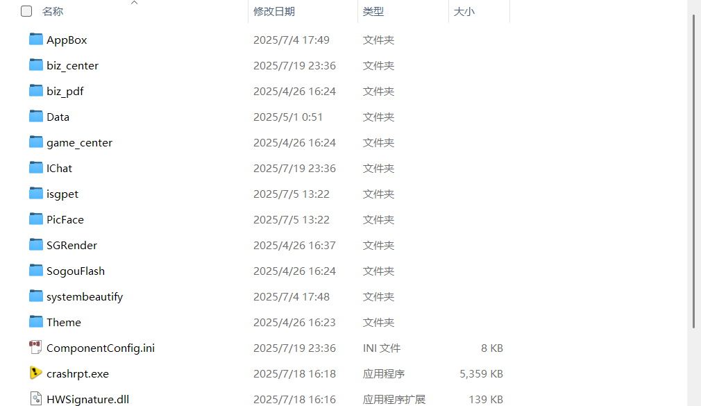
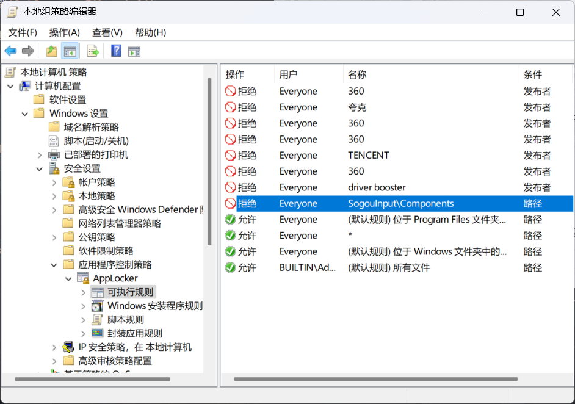

2025年7月19日 我在Windows右键菜单中发现了多余的“更改壁纸”项目，当时我的360处于关闭状态，出于好奇以及自信，我打开了这个流氓——然后它开始下载壁纸组件了……一查任务管理器，居然找不到，但是托盘里面有一个搜狗的标……

我蚌住了

于是，查了半天，发现了这个：

于是，我根据它的路径来到`D:\Program Files (x86)\SogouInput\Components`

可以看到，这是搜狗的组 **(流)** 件 **(氓)** 库 **(窝)**

于是，开始操作

Win + R 键入`gpedit.msc` 回车

选择`计算机配置`>>`Windows设置`>>`安全设置`>>`应用程序控制策略`>>`AppLocker`>>`可执行规则`

右键创建新规则

拒绝 + 路径（就是刚刚的路径） + 无例外

完了再怎么点`Components`里面的exe都没有一点反应，进入搜狗也打不开它的那些流氓功能——至此完美解决！

我不求你安装时不带这些东西（其实如果能不带最好），只求你别突然蹦出来！！！

气煞我也！

---
_关于爆发后的解决方法_
最佳解决方案其实是卸载 然后使用微软输入法或者雾凇拼音。