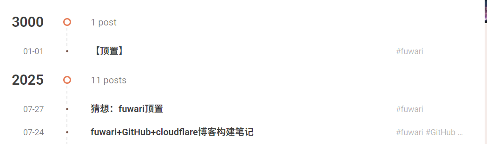

> [!NOTE]
> _cover from https://www.pixiv.net/artworks/128100750_

# 思路

更改`index.md`的文章信息，使它的时间在遥远的未来，根据时间顺序排序的文章则会把它放到最上面。

> [!NOTE]
> _其实我就是懒得改源码_

# 参考

```diff lang="markdown"
---
title: 【顶置】
+published: 3000-01-01
description: "用于测试的置顶文章"
image: "./assets/133074580_p0.jpg"
tags: ["fuwari"]
category: Note
draft: false
---
```
也可以是`9999-12-31`，也是有效的。
# 效果


非常的nice，不需要配置什么环境和图标，也不需要改源码，改一下文章日期就实现了——爽！

# 个性化手段

 [feat: add post pinning feature and fix icon dependencies #317](https://github.com/saicaca/fuwari/pull/317)
