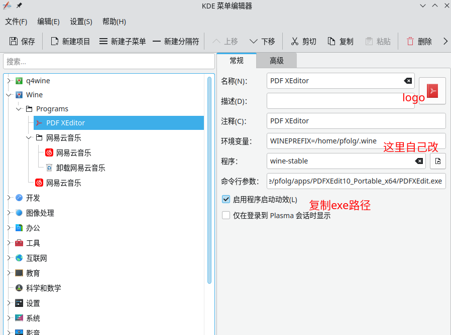
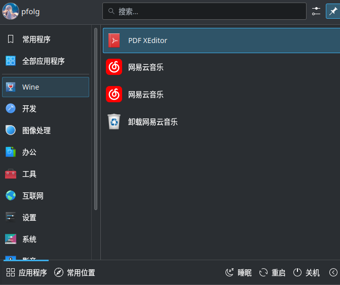
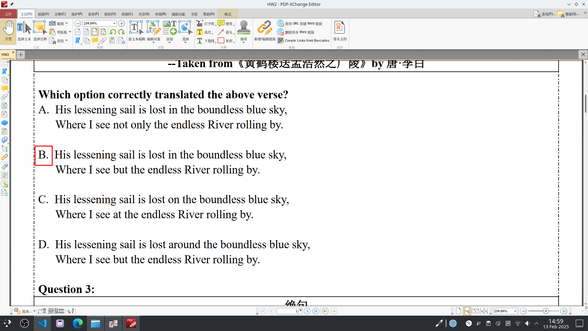

# 写在前面

思路：不寻找现有的开源的PDf编辑器，当前的开源PDF编辑器不够强大，寻求一个windows平台上的强大编辑器，并用wine使用

# PDF XEditor

在互联网上找到并下载这个软件的免费版，我选择64bit的portable版本

# 安装好wine

我推荐直接安装Q4wine（ubuntu）

# 使用与配置

可以用一般方法运行这个编辑器，不过为了方便，我选择在菜单里面编辑一个快捷方式，或者直接在桌面创建链接然后右键选择wine执行。

使用菜单编辑器创建一个项目

不知道环境变量的可以先安装一个别的软件（网易云音乐），然后copy一下，logo选自己喜欢的，环境变量一般这里改一下用户名就行了吧？

# Use it

点击即可启动

